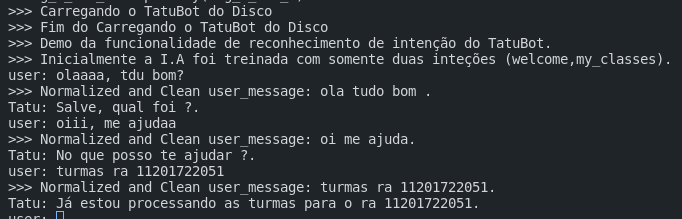

# TatuZap

O TatuZap é um bot de WhatsApp, que tem como objetivo auxiliar os estudantes da UFABC à acessar dados cruciais para o cotidiano da faculdade, como dados da matrícula atual do aluno, salas, professores, matérias, entre outros.

O MVP do TatuZap consiste de dois repositórios, o ETLTatuZap, reponsável por carregar os dados da UFABC periodicamente e popular o banco de dados, e o BotTatuZap, que consiste na IA que será responsável por se comunicar com o usuário e recuperar os dados solicitados no banco já populado.

<hr />

## BotTatuZap


Os códigos presentes neste repositório estão relacionados a geração da I.A utilizada no TatuZap, capaz de realizar uma conversa que atenda as requisições do usuário, utilizando informações fornecidas pelo mesmo em conjunto com nosso back-end (https://github.com/TatuZap/ETLTatuZap).

Dentro do BotTatuZap, pretendemos utilizar as seguintes tecnologias:

* Python(3.8)
* NLTK
* TensorFlow
* Spacy
* Sklearn
* Pandas
* [Enelvo](https://github.com/thalesbertaglia/enelvo) 
* Unittest

# instruções 
## Pré-requisitos:
Como pré-requisitos, se faz necessário uma instalação do Python na versão 3.8. Para mais informações acerca de como
instalar o Python visite https://www.python.org/downloads/.

Com uma instalação do Python3.8 e um cliente git, clone nosso repositorio. Isso pode ser feito com o seguinte comando:
```sh
git clone https://github.com/TatuZap/BotTatuZap
```

O passo seguinte é a execução do makefile que automatiza o download das dependencias (módulos) que utilizamos em nosso projeto. 
No terminal digite:
```sh
cd BotTatuZap && make all
```
Para concluir o setup, execute o script ***nltksetup.py*** que efetua download de algumas dependecia internas para o
funcionamento completo da biblioteca NLTK (Natural Language ToolKit). Esse script deve ser acionado apenas uma vez.
```sh
python3.8 nltksetup.py
```
## Como usar
O arquivo principal que possui toda a funcionalidade da I.A do TatuBot é o ***tatuia.py***. Para executá-lo, digite:
```sh
python3.8 tatuia.py
```

## Exemplo de uso
